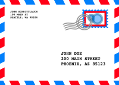

[![Build][build-shield]][build-url]
<!--[![Coverage][coverage-shield]][coverage-url]-->
[![Language][language-shield]][build-url]
[![MIT License][license-shield]][license-url]
[![LinkedIn][linkedin-shield]][linkedin-url]

 

  

<h3 align="center">briefe.app</h3>
  

    Small page to promote my Letter app.
  

### Built With

* [Next.js](https://nextjs.org/)

## License

MIT License. See `LICENSE.txt` for more information.

[build-shield]: https://img.shields.io/github/workflow/status/uebelack/briefe.app/Build.svg?style=for-the-badge
[build-url]: https://github.com/uebelack/briefe.app/actions/workflows/main.yml
[language-shield]: https://img.shields.io/github/languages/top/uebelack/briefe.app.svg?style=for-the-badge
[language-url]: https://github.com/uebelack/briefe.app
[coverage-shield]: https://img.shields.io/coveralls/github/uebelack/briefe.app.svg?style=for-the-badge
[coverage-url]: https://coveralls.io/github/uebelack/briefe.app
[license-shield]: https://img.shields.io/github/license/uebelack/briefe.app.svg?style=for-the-badge
[license-url]: https://github.com/uebelack/briefe.app/blob/master/LICENSE.txt
[linkedin-shield]: https://img.shields.io/badge/-LinkedIn-black.svg?style=for-the-badge&logo=linkedin&colorB=555
[linkedin-url]: https://linkedin.com/in/david-übelacker-600262222
